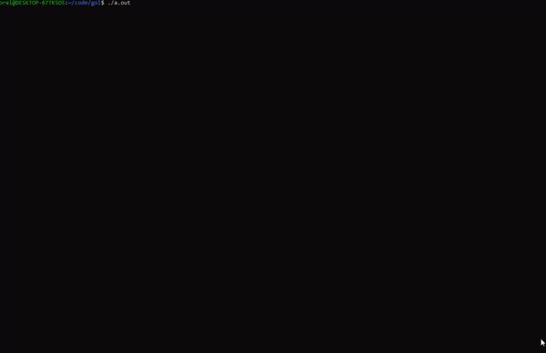

<!-- GETTING STARTED -->
## Getting Started


### Prerequisites

* C99
* GNU
* LINUX 
     ```sh
         #include <unistd.h>
      ``


### Installation

1. Clone the repo
   ```sh
   git clone https://github.com/orelyehuda/GameOfLifeC.git
   ```
   

<!-- USAGE-->
## Usage
 ```sh
   gcc gol.c
```
   ```sh
   ./a.out
   ```


DEMO

1.

